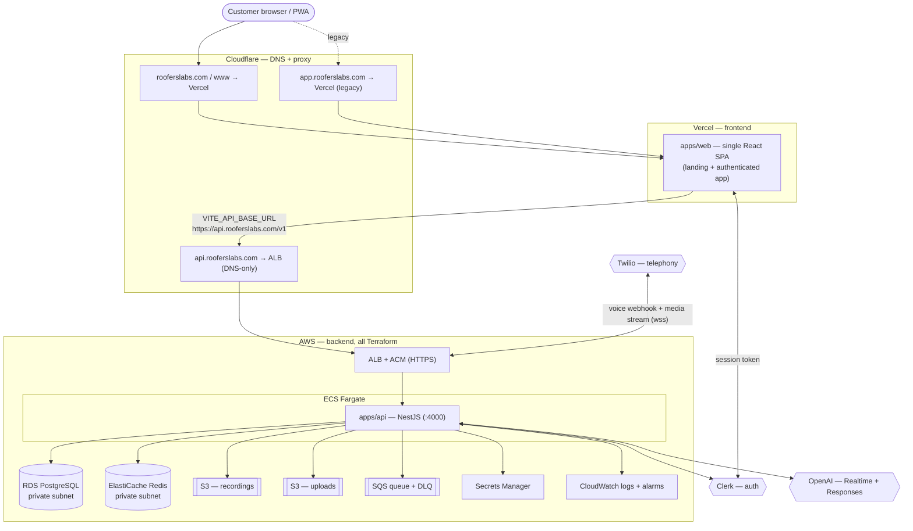

# RoofersLabs — Production Readiness (r1 Echo)

Operator runbook for first-customer go-live. Covers the deployment topology,
the apex-domain migration, and the exact steps to reset the platform to a clean,
never-onboarded state. Anything that touches a live external service (AWS,
Vercel, Cloudflare, Clerk, Twilio) is a **manual** step here — it cannot be, and
must not be, run blindly from a workstation.

---

## 1. Deployment architecture



**Summary**

| Layer | Service | Source of truth |
|---|---|---|
| Frontend | Vercel (single project, `apps/web`) | `vercel.json`, Vercel dashboard |
| Backend API | AWS ECS Fargate (`apps/api`, NestJS) | `infra/terraform` |
| Edge/HTTPS | AWS ALB + ACM | `infra/terraform/modules/alb` |
| Database | AWS RDS PostgreSQL (private) | `modules/rds` |
| Cache | AWS ElastiCache Redis (private) | `modules/redis` |
| Storage | AWS S3 (recordings, uploads) | `modules/s3` |
| Queue | AWS SQS + DLQ (provisioned; consumers land later) | `modules/sqs` |
| Secrets | AWS Secrets Manager → ECS task | `modules/secrets` |
| Observability | CloudWatch logs + alarms | `modules/observability` |
| DNS | Cloudflare (NOT in Terraform) | Cloudflare dashboard |
| Auth | Clerk | Clerk dashboard |
| AI | OpenAI (Realtime + Responses + embeddings) | Secrets Manager |
| Telephony | Twilio (per-company numbers via API) | Secrets Manager |

**Vercel consolidation:** the repo defines exactly **one** frontend (the SPA
serves both the marketing landing at `/` and the authenticated app at
`/dashboard`, `/calls`, …). No second frontend project is required or referenced.
If the Vercel account contains extra/duplicate projects, delete them in the
dashboard (Vercel → Project → Settings → Advanced → Delete) and keep the one
wired to this repo's production branch.

**Not integrated (despite appearing on generic go-live checklists):**
- **Stripe** — there is no Stripe code, dependency, env var, or secret anywhere
  in the repo. Billing is not part of r1 Echo. Do not provision `STRIPE_SECRET_KEY`.
- **`TWILIO_PHONE_NUMBER`** — not a global env var. Numbers are purchased/assigned
  **per company** at onboarding via the Twilio API (`PhoneNumbersService`). Only
  `TWILIO_ACCOUNT_SID` + `TWILIO_AUTH_TOKEN` are configured globally.

---

## 2. Domain: serve the public site on the apex `rooferslabs.com`

**Decision:** the frontend is a single SPA, so the marketing site and the app
share one origin. Serve everything on the **apex** `https://rooferslabs.com`
(with `www` → apex redirect); keep the API on `https://api.rooferslabs.com`.
`app.rooferslabs.com` becomes a legacy alias that 301-redirects to the apex.

The repo already accepts the apex: `infra/terraform/.../main.tf` sets
`WEB_PUBLIC_URL=https://rooferslabs.com` and
`CORS_ORIGINS=https://rooferslabs.com,https://www.rooferslabs.com,https://app.rooferslabs.com`.
That change only takes effect after **`terraform apply`**.

### Migration runbook (external — do in this order to avoid an auth outage)

1. **Cloudflare DNS** — add/confirm records:
   - `A`/`CNAME` `rooferslabs.com` → Vercel (per Vercel's "Add domain" instructions), **Proxied**.
   - `CNAME` `www` → Vercel, Proxied (used for the redirect).
   - `CNAME` `api` → the ALB DNS name (`terraform output alb_dns_name`), **DNS-only (grey cloud)** — the ALB terminates TLS via ACM.
2. **Vercel** — Project → Settings → Domains: add `rooferslabs.com` and `www.rooferslabs.com` (set `www` to redirect to apex). Keep `app.rooferslabs.com` attached but set it to redirect to the apex.
3. **Vercel env** (Production): set `VITE_API_BASE_URL=https://api.rooferslabs.com` and `VITE_CLERK_PUBLISHABLE_KEY=pk_live_…`, then **redeploy** (Vite bakes env at build time).
4. **Clerk dashboard** (Production instance): set the primary app/home/frontend origin to `https://rooferslabs.com`; add it to **Allowed origins**; update sign-in/sign-up/after-sign-in/after-sign-out URLs to the apex; keep `app.` only if you want the alias to work during transition.
5. **Terraform** (API CORS/URL): `cd infra/terraform/envs/production && terraform plan` → review the ECS task env diff (CORS_ORIGINS + WEB_PUBLIC_URL) → `terraform apply`. This redeploys the API with the apex allowed.
6. **Verify**: load `https://rooferslabs.com`, sign in, confirm an authenticated API call succeeds (Network tab → request to `https://api.rooferslabs.com/v1/...` returns JSON, not HTML), and `https://app.rooferslabs.com` + `https://www.rooferslabs.com` both 301 to the apex.

Why it can't be automated here: steps 1–4 are external dashboard/API actions with
no local credentials; step 5 mutates live AWS and must be reviewed via `terraform
plan` by a human with the state and AWS access.

---

## 3. Reset to a clean, never-onboarded state (PART 4–8)

Do this only once, right before the first real customer, against production
infra. Each sub-step is independent.

### 3a. Database — wipe data, keep schema + migrations

A fresh RDS instance that was never seeded is already empty — skip if so. To
verify, or to clean a database that had demo/dev data (the seed creates
`Summit Roofing Co.`, slug `summit-roofing-co`):

```bash
# From a host that can reach RDS (bastion / ECS exec / VPN), with the prod URL:
export DATABASE_URL="postgresql://…prod…"

# Preview what exists first:
psql "$DATABASE_URL" -c "SELECT relname, n_live_tup FROM pg_stat_user_tables ORDER BY n_live_tup DESC;"

# Wipe ALL data, preserve schema + _prisma_migrations (guarded, prompts for RESET):
./infra/scripts/reset-production-data.sh
```

`reset-production-data.sql` truncates every `public` table except
`_prisma_migrations` (RESTART IDENTITY CASCADE). Schema, enums, foreign keys,
indexes, and migration history are untouched (PART 5/9). **Never run the seed
(`npm run prisma:seed`) against production.**

### 3b. Clerk — delete development users/orgs

Clerk data lives in Clerk, not your DB. In the **Production** Clerk instance:
- Users → select all dev/test users → Delete. (Or via API: `GET /v1/users` then
  `DELETE /v1/users/{id}` with `CLERK_SECRET_KEY` — script it if there are many.)
- Organizations → delete any test orgs.
- Confirm the app's `users` table is empty (3a) so no stale Clerk↔DB mapping remains.
After this, the first sign-up creates the first real account.

### 3c. Redis — flush cache

```bash
# From within the VPC (ElastiCache is private). redis-cli or a one-off ECS task:
redis-cli -u "$REDIS_URL" FLUSHALL
# Redis holds only rate-limit counters / transient cache — safe to flush.
```

### 3d. SQS — purge queue + DLQ

```bash
aws sqs purge-queue --queue-url "$(terraform -chdir=infra/terraform/envs/production output -raw sqs_queue_url)"
aws sqs purge-queue --queue-url "$(terraform -chdir=infra/terraform/envs/production output -raw sqs_dead_letter_queue_url)"
```

Note: `BACKGROUND_JOBS_INLINE=true` today, so the queue is provisioned but not
yet consumed — it should already be empty.

### 3e. S3 — remove uploaded objects (keep the buckets)

```bash
REC=$(terraform -chdir=infra/terraform/envs/production output -json s3_buckets | jq -r .recordings)
UPL=$(terraform -chdir=infra/terraform/envs/production output -json s3_buckets | jq -r .uploads)
aws s3 rm "s3://$REC" --recursive
aws s3 rm "s3://$UPL" --recursive
# If versioning is on, also delete old versions (list-object-versions → delete-objects).
```

Why not automated here: no AWS credentials, no VPC network path, and these are
irreversible deletions against live stores — they must be run by the operator
who owns the account.

---

## 4. Environment / secrets checklist (PART 10)

**Frontend (Vercel Production env):**

| Var | Required | Value |
|---|---|---|
| `VITE_CLERK_PUBLISHABLE_KEY` | yes | `pk_live_…` (production Clerk) |
| `VITE_API_BASE_URL` | yes (prod) | `https://api.rooferslabs.com` |

**Backend (Terraform vars → Secrets Manager / ECS env):** `DATABASE_URL`,
`REDIS_URL`, `CLERK_SECRET_KEY` (`sk_live_…`), `CLERK_PUBLISHABLE_KEY`,
`OPENAI_API_KEY`, `TWILIO_ACCOUNT_SID`, `TWILIO_AUTH_TOKEN`, `VAPID_PUBLIC_KEY`/
`VAPID_PRIVATE_KEY` (web push), and the derived `API_PUBLIC_URL`/`WEB_PUBLIC_URL`/
`CORS_ORIGINS`. Optional: `CLERK_WEBHOOK_SECRET`. Full reference:
`apps/api/.env.example`, `apps/web/.env.example`. Backend boot validation:
`apps/api/src/config/env.validation.ts` fails fast on missing required vars.

**Action items before go-live:**
- Switch Clerk from **test** to **live** keys everywhere (the local `.env`
  currently uses `pk_test_…` — a development instance).
- Ensure Twilio numbers point their Voice webhook/status callback at
  `https://api.rooferslabs.com/v1/telephony/incoming` and `/status`
  (`terraform output twilio_voice_webhook` / `twilio_status_callback`).

---

## 5. Go-live checklist

- [ ] `terraform apply` (apex CORS/URL) reviewed and applied
- [ ] Cloudflare DNS: apex + www → Vercel (proxied), api → ALB (DNS-only)
- [ ] Vercel: apex attached, www + app redirect to apex, prod env set, redeployed
- [ ] Clerk: live keys, apex origins + redirect URLs
- [ ] Database reset verified empty; migrations intact; seed NOT run
- [ ] Clerk dev users/orgs deleted
- [ ] Redis flushed; SQS + DLQ purged; S3 emptied
- [ ] Twilio webhooks point at the prod API
- [ ] Smoke test: sign up as the first real user → onboarding → dashboard loads empty
```
